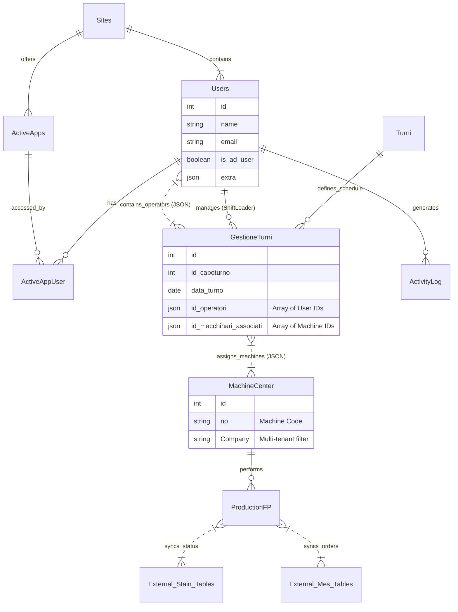
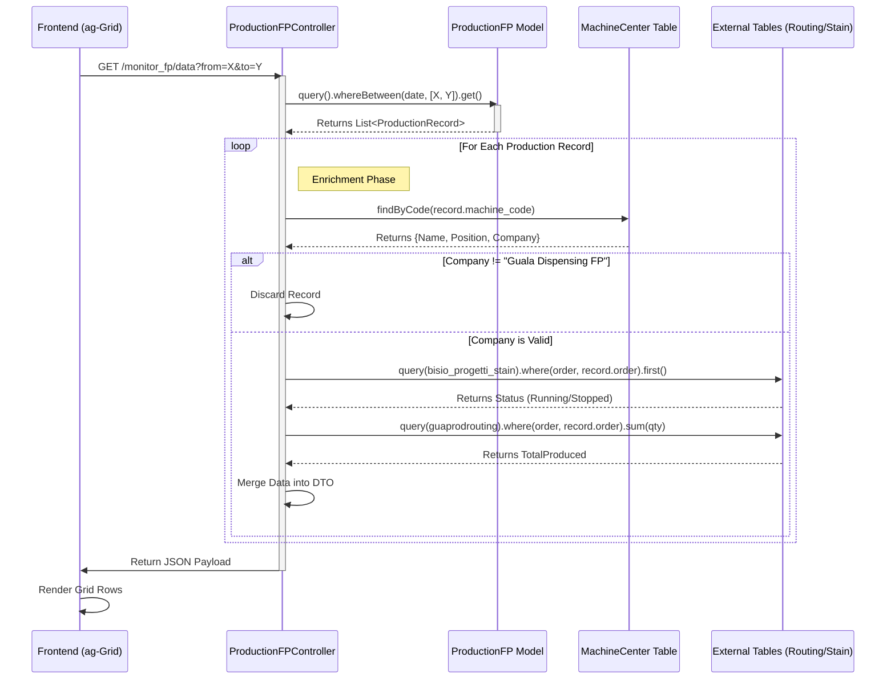

# Master System Architecture Document
**Version**: 1.0
**Date**: 2026-01-22
**Status**: Living Document
**Scope**: Comprehensive Technical Analysis of Guala-App

---

## 1. Executive System Summary

### 1.1. System Purpose & Identity
The **Guala-App** is a **Manufacturing Execution System (MES) Aggregator and Shift Management Platform**. It serves as the digital "nervous system" for a manufacturing facility (specifically tailored for Guala Dispensing FP), bridging the gap between physical shop floor operations and high-level ERP/management systems.

Unlike a standard CRUD application, Guala-App functions primarily as a **Synchronization and Enrichment Layer**. It does not own the "master data" for orders or machines (which likely reside in external systems like SAP, Business Central, or Stain); instead, it ingests this data, enriches it with human context (shift assignments, comments, operator notes), and presents it in real-time dashboards.

### 1.2. Core Business Logic "The Bridge"
The system operates on three primary axes of logic:

1.  **The Human Axis (Shift Management)**:
    *   **Input**: Supervisors assign specific Operators to specific Machines/Presses for a specific Shift (Morning/Afternoon/Night).
    *   **Logic**: This is the system's "System of Record" capability. It maps `Users` to `MachineCenters` via `GestioneTurni` using complex JSON-based relationships.
    *   **Output**: A digital roster that dictates who is responsible for what production line at any given moment.

2.  **The Machine Axis (Production Monitoring)**:
    *   **Input**: Raw telemetry and order data from shop floor systems (MES, Piovan, Stain).
    *   **Logic**: The system aggregates this disparate data. It correlates a "Production Order" from MES with the "Machine Status" from Stain and the "Batch Info" from Piovan.
    *   **Output**: The `Monitor FP` and `APP1` dashboards—unified control towers showing real-time production status, efficiency, and alerts.

3.  **The Governance Axis (Audit & Control)**:
    *   **Input**: User actions (logins, updates, comments).
    *   **Logic**: Active Directory (LDAP) integration ensures corporate identity compliance. Spatie Activity Log records every significant mutation.
    *   **Output**: A fully auditable trail of "Who changed the production comment?" or "Who was the shift leader during the downtime?"

---

## 2. Full-Stack Data Flow Traces

This section traces the lifecycle of data through the stack for the system's three most critical workflows.

### 2.1. Critical Workflow 1: The "Corporate Handshake" (Login & Context Hydration)
*This flow represents the security and initialization phase.*

1.  **User Interaction**: User visits `/login` and submits corporate credentials (username/password).
2.  **Route Handling**: `POST /login` is intercepted by Laravel's built-in Auth scaffolding (customized via `ldaprecord-laravel`).
3.  **Authentication Provider**:
    *   The system attempts to bind against the configured **Active Directory (LDAP)** server.
    *   **Success**: If AD validates credentials, the local `users` table is checked/synced to ensure the user exists locally.
    *   **Session Start**: A standard Laravel session is initiated.
4.  **Event Dispatch (`Illuminate\Auth\Events\Login`)**:
    *   Laravel fires the standard login event.
    *   **Listener 1: `LogSuccessfulLogin`**:
        *   Captures User ID, IP Address, and User Agent.
        *   Writes a structured record to the `activity_log` table (via Spatie).
    *   **Listener 2: `UpdateDictionaryOnLogin`** (Crucial Step):
        *   Checks if the user has `admin` privileges.
        *   **If Admin**: It reads the huge array from `config/dizionario.php`.
        *   It iterates through the config and performs an `updateOrCreate` on the `dictionary_table` database table.
        *   *Why?* This ensures that any developer changes to translation files are automatically pushed to the database for the frontend to consume, without running a separate seeder command.
5.  **Redirect**: User is sent to `/home`.

### 2.2. Critical Workflow 2: The "Control Tower" Load (Monitor FP)
*This flow demonstrates the system's complex data aggregation capability.*

1.  **Frontend Request**: User opens `/monitor_fp`. The page loads the HTML shell. The `ag-grid` component initializes and fires an AJAX request to `GET /monitor_fp/data`.
2.  **Controller Entry (`ProductionFPController@index`)**:
    *   The controller accepts query parameters (e.g., `?from=2023-01-01&to=2023-01-02`).
3.  **Phase 1: Primary Data Fetch**:
    *   Executes a query against the `ProductionFP` model (likely a view or table syncing with MES).
    *   *Result*: A list of raw production records (Order IDs, Item IDs, timestamps).
4.  **Phase 2: The Enrichment Loop (The "N+1" Risk Zone)**:
    *   The controller iterates through the production records.
    *   **Machine Mapping**: It extracts the `machine_code` from the record. It queries the `Macchine` table to find the human-readable Name and physical Position (e.g., "Press 05").
    *   **Status Sync**: It queries `bisio_progetti_stain` (external system table) using the Order ID to fetch the real-time status (Running, Stopped, Maintenance).
    *   **Quantity Calculation**: It queries `table_guaprodrouting` to sum up `TotaleQtaProdottaBuoni` (Total Good Quantity) for that specific order.
5.  **Phase 3: Filtering & Serialization**:
    *   The enriched collection is filtered. Any record not belonging to the company "Guala Dispensing FP" (checked via the Machine's `Company` attribute) is discarded.
    *   The data is transformed into a flat JSON object optimized for `ag-grid`.
6.  **Response**: The huge JSON payload is returned to the browser.
7.  **Frontend Rendering**: `ag-grid` parses the JSON and renders the rows. Custom cell renderers apply color coding based on the Status (Green for Running, Red for Stopped).

### 2.3. Critical Workflow 3: Shift Roster Definition (Gestione Turni)
*This flow illustrates the "JSON as Relational Data" anti-pattern/pattern used in the system.*

1.  **Frontend Request**: Shift Manager clicks "Edit Shift" on `/APP2`. `GET /APP2/form/{id}` is called.
2.  **Form Hydration**:
    *   **Operators**: Controller fetches all users where `ruolo_personale` = 'Operatore Assemblaggio'.
    *   **Machines**: Controller fetches all `machine_center` rows where `Company` = 'Guala Dispensing FP'.
    *   **Current State**: Fetches the `GestioneTurni` row for the requested ID.
3.  **User Action**: The manager selects 5 operators and 3 machines from multi-select dropdowns and clicks "Save".
4.  **Submission (`POST /APP2/form`)**:
    *   Payload: `{ id_turno: 1, data: '2023-10-25', operators: [10, 45, 99], machines: [2, 8] }`.
5.  **Data Normalization (`GestioneTurniController@store`)**:
    *   The controller calls a helper method `toIdArray()`.
    *   It detects if inputs are comma-separated strings or arrays and unifies them into PHP Arrays.
6.  **Persistence**:
    *   The PHP Arrays are `json_encode`d.
    *   The database row is updated:
        *   `id_operatori` column stores `"[10,45,99]"`
        *   `id_macchinari_associati` column stores `"[2,8]"`
    *   *Architectural Note*: There is no pivot table (e.g., `shift_user`). The relationship is stored directly in the `gestione_turni` table as a JSON string.
7.  **Confirmation**: JSON "OK" response is sent. Frontend refreshes the grid.

---

## 3. Architecture Visualizations

### 3.1. Entity Relationship Diagram (High-Level)
This diagram highlights the hybrid Relational/JSON structure.



### 3.2. Sequence Diagram: Production Monitor Data Load
The complex logic of `ProductionFPController@index`.



---

## 4. Code Quality & Security Audit

### 4.1. Architecture Risks & Technical Debt
1.  **JSON Columns for Relations (`GestioneTurni`)**:
    *   *Risk*: High. Storing Foreign Keys (`id_operatori`) as a JSON array prevents the database from enforcing Referential Integrity (ON DELETE CASCADE). If a User is deleted, their ID remains orphaned in the JSON string.
    *   *Query Impact*: You cannot efficiently join tables. To find "All shifts for User X", you must use slow `LIKE '%"id":X%'` queries or JSON extraction functions, killing performance at scale.
2.  **Controller Bloat (God Objects)**:
    *   *Risk*: Medium. Controllers like `ProductionFPController` contain raw business logic, data fetching, and transformation. This makes unit testing the business logic nearly impossible without mocking the entire HTTP request/Database.
3.  **N+1 Query Performance**:
    *   *Risk*: High. The loops inside `ProductionFPController` suggest that for 100 production records, the system might fire 300+ database queries (1 for Machine, 1 for Status, 1 for Qty). *Recommendation*: Eager Loading (`with()`) or batching IDs for `whereIn` queries.

### 4.2. Security Posture
1.  **Authentication**: **Strong**. Using `ldaprecord-laravel` delegates security to the corporate Active Directory, which is industry standard.
2.  **Audit Trail**: **Strong**. `spatie/laravel-activitylog` provides excellent visibility.
3.  **Authorization**: **Medium**. The system uses `can:ADMIN` middleware, but deeper row-level security (e.g., "Can this Shift Leader edit *this* specific shift?") relies on ad-hoc controller logic rather than standardized Policies.
4.  **Input Validation**: **Medium**. Validation happens in controllers. The manual `toIdArray` normalization suggests the frontend might be sending inconsistent data types, which is a potential vector for bugs.

### 4.3. Dependency Health
*   **Laravel 12.x / PHP 8.2**: **Excellent**. Cutting edge.
*   **Vite 6.x**: **Excellent**. Modern build pipeline.
*   **jQuery**: **Absent**. The move to Vanilla JS + Axios is clean.
*   **Bootstrap 5 + Tailwind 4**: **Hybrid Risk**. Mixing two CSS frameworks often leads to specificity wars and "z-index hell".

---

## 5. Developer 'Cheatsheet'

### 5.1. Rapid Orientation
*   **Where is the UI?**
    *   It's **Server-Side Rendered Blade**. Go to `resources/views`.
    *   *Admin Pages*: Look in `resources/views/vendor/adminlte`.
    *   *App Pages*: Look in `resources/views/app/`.
*   **Where is the JS Logic?**
    *   It's **Inline** or in `resources/js/app.js`.
    *   Look for `@section('js')` at the bottom of Blade files. This is where the `ag-grid` config lives.
*   **Where is the Database Config?**
    *   It's hybrid. `config/database.php` handles connections.
    *   *Warning*: The app connects to external tables (`bisio_progetti_stain`). Ensure your local `.env` has read access to these secondary databases or mocks them.

### 5.2. "How Do I..."
*   **...Add a new column to a table?**
    1.  `php artisan make:migration add_column_to_table_x`
    2.  Edit the migration file.
    3.  `php artisan migrate`
    4.  **Crucial**: If it's a "virtual" column needed in the frontend, update the Controller's `json()` method to include it in the response.
*   **...Change a translation?**
    1.  Do **NOT** edit the database directly.
    2.  Edit `config/dizionario.php`.
    3.  Log out and log back in as Admin. The `UpdateDictionaryOnLogin` listener will auto-sync your changes to the DB.
*   **...Debug a production error?**
    1.  Check `storage/logs/laravel.log`.
    2.  Check the `activity_log` table in the DB to see *who* did it.
    3.  Use `php artisan pail` to tail logs in real-time.

### 5.3. The "Hard Reset" Protocol
To wipe the system and start fresh (Development Only):

```bash
# 1. Clear compiled caches
php artisan optimize:clear

# 2. Rebuild Database (Drops all tables!)
# Note: This will destroy shift data.
php artisan migrate:fresh --seed

# 3. Rebuild Frontend Assets
npm run build

# 4. Clear Local Storage
# (In Browser DevTools -> Application -> Clear Site Data)
# This clears old ag-grid column states.
```
