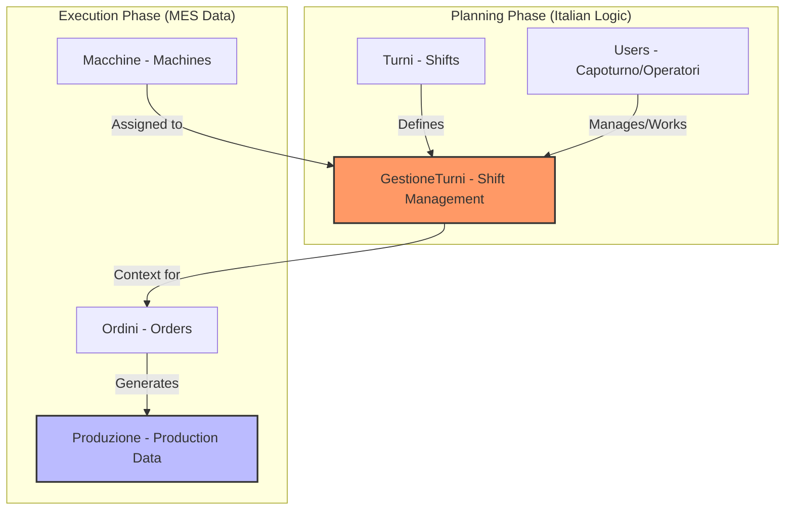

# Project Explanation & Technical Dictionary

## 1. Project Overview: What is Guala-App?

The **Guala-App** is a specialized **Manufacturing Execution System (MES) Aggregator**. Its primary role is to act as a centralized "Control Tower" for a manufacturing facility. It collects data from various shop-floor sources (machine sensors, ERP systems, and manual human input) and presents it in a unified interface for managers and operators.

### Core Functions:
1.  **Shift Planning**: Scheduling which operators work on which machines during specific time slots.
2.  **Real-Time Monitoring**: Displaying live production metrics (quantities, machine status, order progress).
3.  **Data Enrichment**: Allowing users to add human context (comments, downtime reasons, batch notes) to raw machine data.
4.  **Audit & Compliance**: Tracking every change and login for security and quality control.

---

## 2. Italian-English Technical Dictionary

The codebase uses Italian nomenclature for many database tables, columns, and business logic terms. Use this table as a reference.

### 2.1. Core Entities (Tables & Models)

| Italian Term | English Translation | Context/Usage |
| :--- | :--- | :--- |
| **Turni** | Shifts | Defines time periods (Morning, Afternoon, Night). |
| **Gestione Turni** | Shift Management | The logic/table that assigns people to machines for a shift. |
| **Macchine** | Machines | General production equipment. |
| **Presse** | Presses | Specific type of molding machinery. |
| **Stampaggio** | Stamping / Molding | The production process of forming parts. |
| **Assemblaggio** | Assembly | The process of putting components together. |
| **Aziende** | Companies | Organizations/Sites (used for multi-tenancy). |
| **Ordini** | Orders | Production orders (often synced from SAP/MES). |
| **Codici Oggetto** | Object Codes / SKUs | Unique identifiers for parts or products. |
| **Dizionario** | Dictionary | Translation system for UI labels. |

### 2.2. Roles & Personnel

| Italian Term | English Translation | Role Description |
| :--- | :--- | :--- |
| **Capoturno** | Shift Leader / Supervisor | Manages the roster and oversees the floor. |
| **Operatore** | Operator | The person physically running the machine. |
| **Personale** | Personnel / Staff | General term for employees. |
| **Ruolo** | Role | Permissions level (Admin, Operator, etc.). |

### 2.3. Production Metrics & Actions

| Italian Term | English Translation | Context/Usage |
| :--- | :--- | :--- |
| **Quantità Prodotta** | Quantity Produced | Total units made. |
| **Buoni** | Good (Parts) | Items that passed quality control. |
| **Scarti** | Rejects / Scraps | Items that failed quality control. |
| **Lotto** | Batch / Lot | A specific production run of a product. |
| **Nota / Commento** | Note / Comment | Human-added text to an order or shift. |
| **Stato** | Status | Current condition (Running, Stopped, Maintenance). |
| **Inizio / Fine** | Start / End | Timestamps for shifts or operations. |

---

## 3. System Architecture Diagram

This diagram shows how the Italian-named entities interact to create the "Shift Roster" which then drives the "Production Monitoring".

---

## 4. Developer "Rosetta Stone" (Code Examples)

If you see these patterns in the code, here is how to interpret them in English:

*   **`$id_capoturno`**: The ID of the Supervisor in charge of the shift.
*   **`$id_operatori`**: A list (often JSON) of workers assigned to the machines.
*   **`$tableviewAssemblaggio`**: The dashboard for the Assembly line.
*   **`UpdateDictionaryOnLogin`**: A process that syncs UI translations from a PHP file to the database.
*   **`toIdArray()`**: A helper that converts messy user input (like comma-separated names) into a clean list of IDs.
