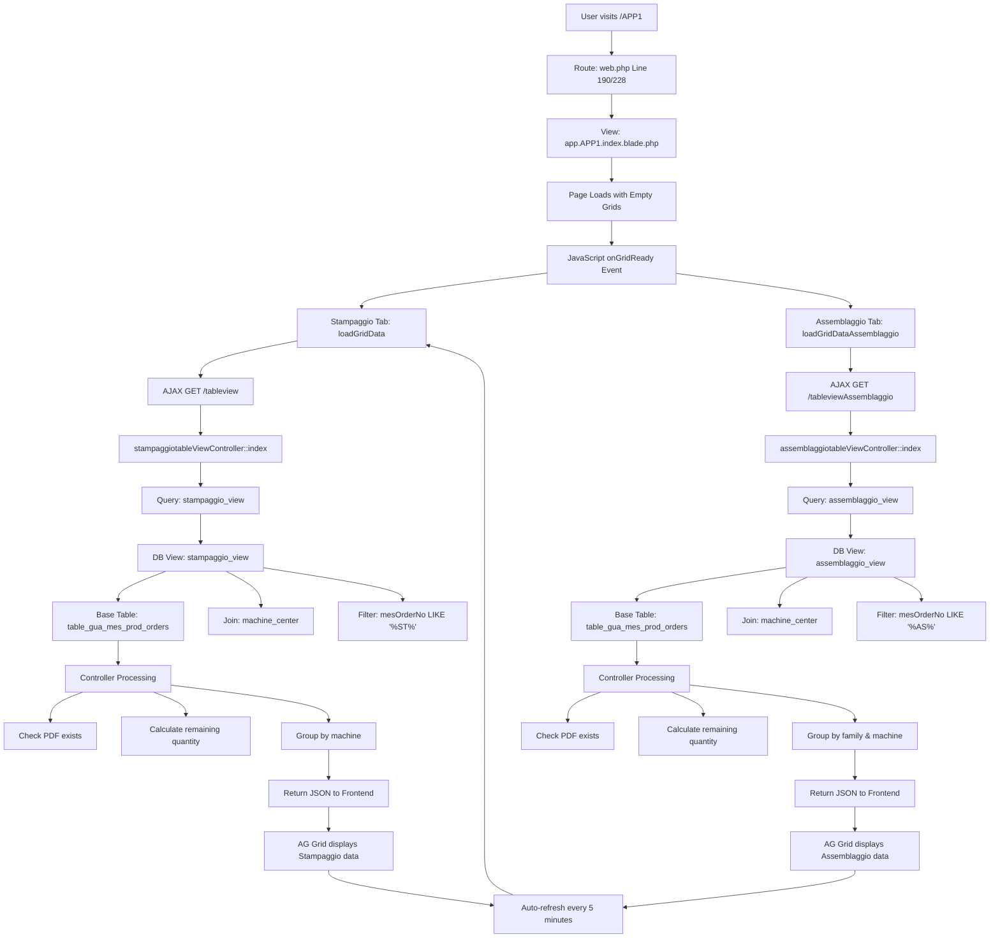

# APP1 Route Data Flow Analysis

## Route Definition

**Location:** [routes/web.php](file:///c:/xampp/htdocs/guala/guala-app/routes/web.php#L190-L192)

```php
Route::get('/APP1', function () {
    return view('app.APP1.index');
})->name('app.app1');
```

> [!IMPORTANT]
> This route is defined **twice** in the file (lines 190 and 228). The second definition at line 228 is outside the admin middleware group, while the first at line 190 is inside it.

---

## View File

**Location:** [resources/views/app/APP1/index.blade.php](file:///c:/xampp/htdocs/guala/guala-app/resources/views/app/APP1/index.blade.php)

### View Structure

The view displays two tabs:
1. **Stampaggio** (Stamping) - Default active tab
2. **Assemblaggio** (Assembly) - Secondary tab

Both tabs use **AG Grid** to display production data in a table format with grouping capabilities.

### Expected Data (Missing from Route)

Lines 84-85 expect translation variables that are **NOT** passed by the route:
```php
window.LABELS_STAMPAGGIO = @json($trad_stampaggio);
window.LABELS_ASSEMBLAGGIO = @json($trad_assemblaggio);
```

> [!WARNING]
> The route returns the view without passing these variables, which will cause errors. These variables should be passed from the route closure or a controller.

---

## Data Loading Mechanism

The view **does NOT receive data directly from the route**. Instead, it uses **AJAX calls** to fetch data dynamically:

### 1. Stampaggio Tab Data

**Endpoint:** `/tableview`  
**Controller:** [stampaggiotableViewController::index()](file:///c:/xampp/htdocs/guala/guala-app/app/Http/Controllers/stampaggiotableViewController.php#L8-L40)  
**JavaScript Function:** `loadGridData()` at line 505

```javascript
fetch("{{ url('/tableview') }}", {
    method: "GET",
    headers: { "Content-Type": "application/json", "X-CSRF-TOKEN": ... }
})
```

### 2. Assemblaggio Tab Data

**Endpoint:** `/tableviewAssemblaggio`  
**Controller:** [assemblaggiotableViewController::index()](file:///c:/xampp/htdocs/guala/guala-app/app/Http/Controllers/assemblaggiotableViewController.php#L8-L56)  
**JavaScript Function:** `loadGridDataAssemblaggio()` at line 483

```javascript
fetch("{{ url('/tableviewAssemblaggio') }}", {
    method: "GET",
    headers: { "Content-Type": "application/json", "X-CSRF-TOKEN": ... }
})
```

### Auto-Refresh

Data is automatically refreshed every **5 minutes** (300,000 milliseconds) - see line 525:
```javascript
setInterval(() => {
    aggiornaTimer();
    if (gridApiStampaggio) loadGridData(gridApiStampaggio);
    if (gridApiAssemblaggio) loadGridDataAssemblaggio(gridApiAssemblaggio);
}, 300000);
```

---

## Database Views (Yes, You Were Right!)

Both controllers query **database views** rather than tables directly.

### 1. Stampaggio View

**View Name:** `stampaggio_view`  
**Migration:** [2025_05_27_140011_create_stampaggio_view.php](file:///c:/xampp/htdocs/guala/guala-app/database/migrations/2025_05_27_140011_create_stampaggio_view.php#L65-L75)

#### SQL Definition

```sql
CREATE VIEW stampaggio_view AS 
SELECT 
    mpo.*, 
    mc.GUAPosition AS GUAPosition,
    CONCAT(mpo.machinePress, ' ', mpo.machinePressDesc) AS machinePressFull
FROM table_gua_mes_prod_orders AS mpo
LEFT JOIN machine_center AS mc 
    ON mpo.machinePress = mc.no
WHERE mpo.mesOrderNo LIKE '%ST%';
```

#### Base Tables
- **`table_gua_mes_prod_orders`** (aliased as `mpo`) - Main production orders table
- **`machine_center`** (aliased as `mc`) - Machine information table

#### Filter Condition
- Only orders where `mesOrderNo` contains **'ST'** (Stampaggio/Stamping orders)

---

### 2. Assemblaggio View

**View Name:** `assemblaggio_view`  
**Migration:** [2025_05_27_140118_create_assemblaggio_view.php](file:///c:/xampp/htdocs/guala/guala-app/database/migrations/2025_05_27_140118_create_assemblaggio_view.php#L18-L30)

#### SQL Definition

```sql
CREATE OR REPLACE VIEW assemblaggio_view AS
SELECT 
    o.*, 
    CONCAT(o.machineSatmp, ' - ', m.name) AS nome_completo_macchina
FROM 
    table_gua_mes_prod_orders o
JOIN 
    machine_center m 
    ON o.machineSatmp = m.GUAPosition
WHERE 
    o.mesOrderNo LIKE '%AS%';
```

#### Base Tables
- **`table_gua_mes_prod_orders`** (aliased as `o`) - Main production orders table
- **`machine_center`** (aliased as `m`) - Machine information table

#### Filter Condition
- Only orders where `mesOrderNo` contains **'AS'** (Assemblaggio/Assembly orders)

---

## Controller Query Logic

### Stampaggio Controller Query

**File:** [stampaggiotableViewController.php](file:///c:/xampp/htdocs/guala/guala-app/app/Http/Controllers/stampaggiotableViewController.php#L10-L18)

```php
$rows = DB::table('stampaggio_view')
    ->whereNotNull('mesOrderNo')
    ->where('mesOrderNo', '!=', '')
    ->whereNotNull('itemNo')
    ->where('itemNo', '!=', '')
    ->orderBy('machinePressFull')
    ->orderBy('GUAPosition')
    ->orderBy('relSequence')
    ->get();
```

#### Additional Processing
1. **PDF Check:** Verifies if a PDF file exists for each order at `public/bolle_lavorazione_pdf/{mesOrderNo}.pdf`
2. **Machine Label:** Prepends position to machine name: `"Pr " . $row->GUAPosition . " - " . $row->machinePressFull`
3. **Remaining Quantity:** Calculates `quantita_rimanente = quantity - quantita_prodotta`
4. **Grouping:** Groups by `machinePressFull`

---

### Assemblaggio Controller Query

**File:** [assemblaggiotableViewController.php](file:///c:/xampp/htdocs/guala/guala-app/app/Http/Controllers/assemblaggiotableViewController.php#L10-L18)

```php
$rows = DB::table('assemblaggio_view')
    ->whereNotNull('mesOrderNo')
    ->where('mesOrderNo', '!=', '')
    ->whereNotNull('itemNo')
    ->where('itemNo', '!=', '')
    ->orderBy('family')
    ->orderBy('nome_completo_macchina')
    ->orderBy('relSequence')
    ->get();
```

#### Additional Processing
1. **PDF Check:** Same as Stampaggio
2. **Remaining Quantity:** Same calculation
3. **Grouping:** Two-level grouping:
   - First by `family`
   - Then by `nome_completo_macchina` (machine full name)
4. **Filtering:** Excludes machines with name `'MPACK - PACKAGING'`

---

## Complete Data Flow Diagram



---

## Key Database Tables

### table_gua_mes_prod_orders

This is the **main production orders table** containing:
- `mesOrderNo` - MES order number (contains 'ST' for stamping or 'AS' for assembly)
- `itemNo` - Item/product code
- `itemDescription` - Item description
- `machineSatmp` - Machine stamping code
- `machinePress` - Press machine code
- `machinePressDesc` - Press machine description
- `relSequence` - Sequence number
- `quantity` - Order quantity
- `quantita_prodotta` - Produced quantity
- `commento` - Comments
- `family` - Product family
- `id` - Primary key

### machine_center

Machine information table containing:
- `no` - Machine number
- `GUAPosition` - Machine position
- `name` - Machine name

---

## Additional Features

### Comment Saving

Users can add comments to orders. When a comment is changed:

**Endpoint:** `/save-comment` (POST)  
**Controllers:** Both controllers have `updateCommento()` method  
**Target Table:** `table_gua_mes_prod_orders`

```php
DB::table('table_gua_mes_prod_orders')
    ->where('id', $request->input('id'))
    ->update(['commento' => $request->input('commento')]);
```

### PDF Generation

Both tabs have PDF export functionality:

1. **Assemblaggio PDF:** Route `app1.pdf.stampa` → [assemblaggiotableViewController::stampa()](file:///c:/xampp/htdocs/guala/guala-app/app/Http/Controllers/assemblaggiotableViewController.php#L67-L117)
2. **Stampaggio PDF:** Route `app1.pdf_stampaggio.stampa` → [stampaggiotableViewController::stampa()](file:///c:/xampp/htdocs/guala/guala-app/app/Http/Controllers/stampaggiotableViewController.php#L52-L89)

---

## Summary

The `/APP1` route displays a monitoring dashboard for production orders with two tabs:

1. **Data Source:** Two database views (`stampaggio_view` and `assemblaggio_view`)
2. **Base Table:** `table_gua_mes_prod_orders` joined with `machine_center`
3. **Data Loading:** AJAX calls to controller endpoints (not passed from route)
4. **Filtering:** 
   - Stampaggio: Orders with 'ST' in `mesOrderNo`
   - Assemblaggio: Orders with 'AS' in `mesOrderNo`
5. **Refresh:** Auto-refreshes every 5 minutes
6. **Features:** PDF export, comment editing, order details popup
